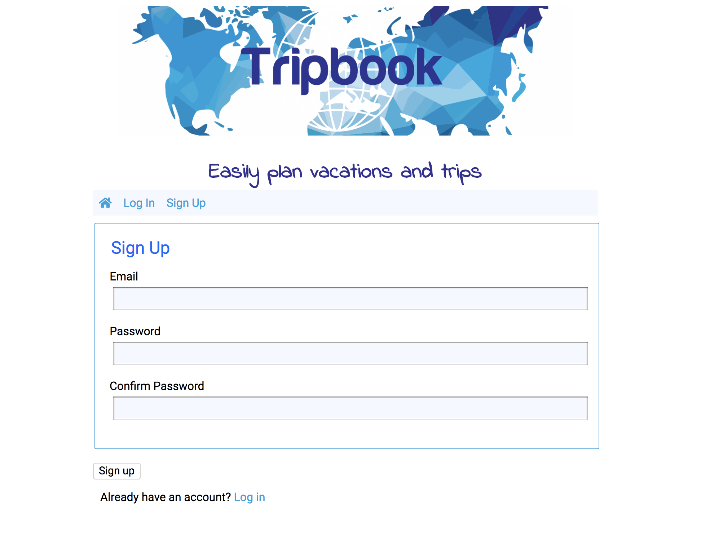
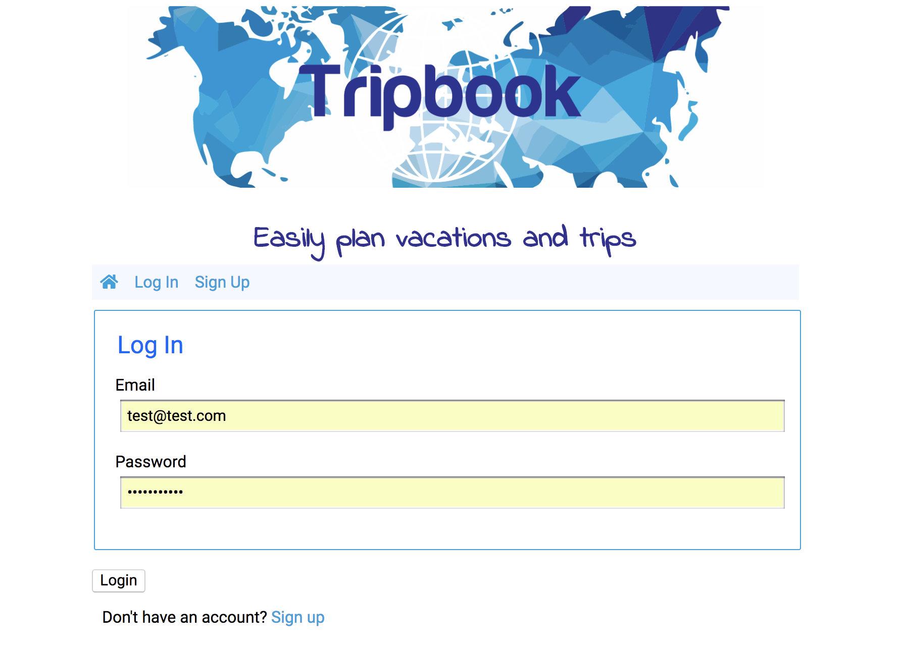
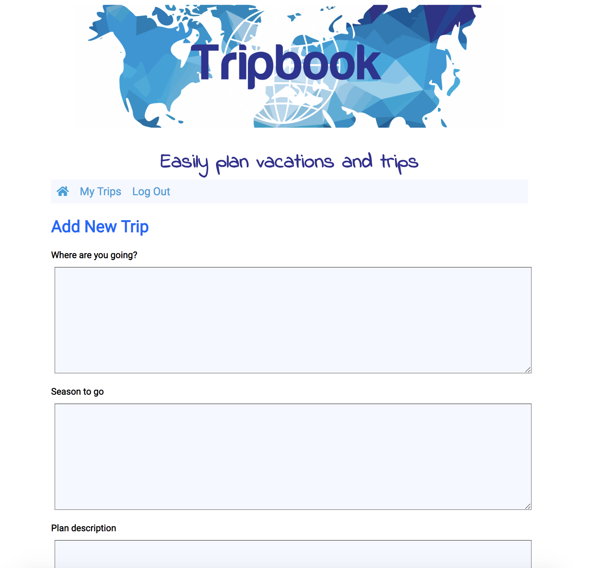
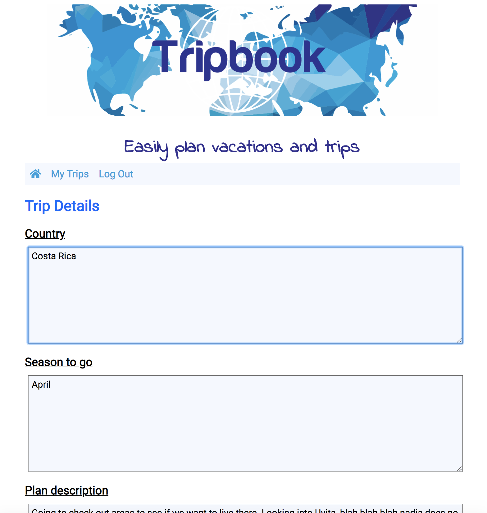

# Tripbook

_An application for easily planning vacations and trips_

Tripbook came about while planning a year-long trip around the world with my wife.
To make thinks clearer and ensure that the right information was added for each country, I created an app which requires specific information regarding each country the user plans to travel to. Each country's information is stored in an easy to navigate dashboard for future reference.

## Give it a try!

Live Link: [Tripbook](https://node-tripbook-app.herokuapp.com/)

## Tecnhnology used

### Front End

- JavaScript
- JQuery
- CSS
- HTML

### Back End

- Node
- Express Framework
- Passport Authentification
- Jwt Security

### Testing

- Chai
- Chai-http
- Mocha

## Screenshots

### Landing Page View / Sign Up View:

### Login View:

### User Dashboard View:

### Add Trip View:

### Edit a Trip View:

